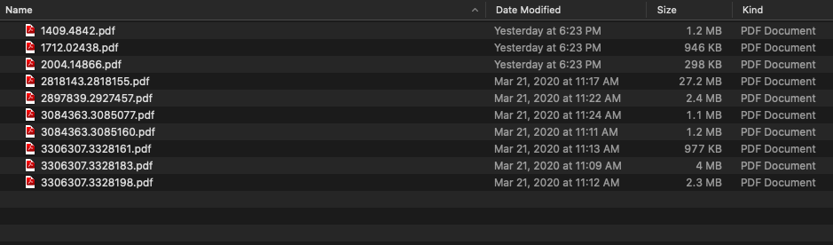
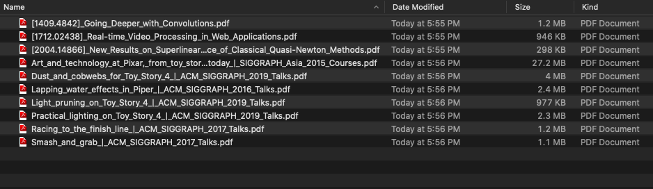

# Resolve Paper Titles from Reference IDs

Currently supports arxiv.org and dl.acm.org. More coming soon.

### To-Do List
* Support for: IEEE, Distill, etc.
* Take input and output directories as arguments

# Examples

### Turn a directory that looks likes this

### To this

